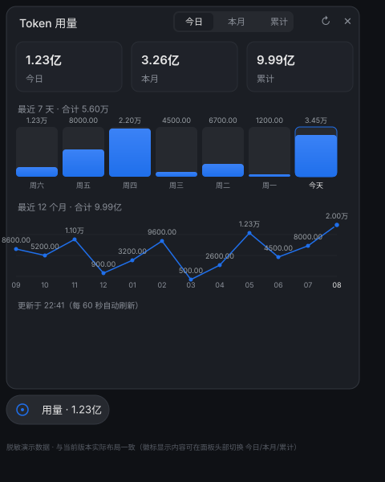

# dsh-usage-stats

[](https://github.com/menghun3-cn/dsh-usage-stats/releases/latest)
[](https://github.com/menghun3-cn/dsh-usage-stats/actions/workflows/ci.yml)
[](LICENSE)

为 [DeepSeek Harness](https://github.com/deepseek-ai/deepseek-harness) 网页端提供 **Token 用量统计面板**。

Token usage analytics for the DeepSeek Harness Web GUI (`dsh web`).



> 展示图使用脱敏演示数据，与当前面板布局一致（深色主题示意）；`docs/images/usage-panel.svg` 为 0.2.0 旧界面存档，仅作历史对照。

## 能力速览

| | 能力 | 说明 |
| --- | --- | --- |
| 徽标 | 左下角悬浮徽标 | 显示「用量 · 今日」tokens（两位小数），可切换为 今日 / 本月 / 累计，选择会持久化 |
| 汇总 | 三个汇总卡 | 今日、本月、累计 tokens（舍入到两位小数，万/亿自动换算） |
| 柱图 | 最近 7 天柱状图 | 每根柱子顶部直接标注数值；点击柱子下钻当天 明细（输入/输出/缓存命中/缓存读写/模型拆分） |
| 折线 | 最近 12 个月折线图 | 每个线点上方标注数值、下方标注月份；点击线点下钻该月 每日用量 |
| 刷新 | 自动刷新 | 插件挂载后每 60 秒刷新一次，面板开合都一样；跨天数字自动翻新为今日 |
| 保留 | 有界历史 | 服务端只保留最近 400 天（12 个月 + 余量），缓存文件不会无限膨胀 |

- 数据来自 `assistant/chunk` / `assistant/message` 中 provider 上报的 `usage`，不是本地估算。
- 统计完全在本机进行，凭据、提示词、回复与文件路径从不进入面板或缓存。
- 面板支持中文和英文，跟随 Harness 界面语言。

## 面板结构

点击屏幕左下角的「用量」悬浮按钮展开面板（再次点击空白处或按 `Esc` 收起）：

1. **标题栏**：左侧「Token 用量」；右侧 今日/本月/累计 切换器（决定徽标显示哪个数字）、生成分享图片、刷新、关闭。
2. **汇总卡**：「今日」「本月」「累计」三个汇总，格式始终为两位小数（`9999.00` / `1.23万` / `1.23亿`）。
3. **最近 7 天柱状图**：按本地日历取最近 7 天（含今天，零用量天保留占位），柱顶直接标注数值；点击任一柱子查看当天详情。
4. **最近 12 个月折线图**：按本地日历聚合最近 12 个月（含当前月），线点上方标注数值、下方标注 MM 月份；当前月带高亮圆环；点击任一线点下钻该月每日用量。
5. 详情视图均可返回主面板；标题栏「更新于 HH:MM」显示最近一次成功刷新的时刻。每个视图都带分享按钮，分享图按上下文渲染（主面板 / 当天 / 当月）。

## 选哪种安装方式

| 你的情况 | 推荐方式 |
| --- | --- |
| 桌面端（Electron，DSH 0.2.0-rc.2+） | `dsh plugin --profile desktop add …`（见下方「桌面版 GUI」） |
| 浏览器端（`dsh web` 或 0.1.x CLI） | `dsh plugin --profile web add …`（见下方「Web profile」） |
| `dsh plugin` 不可用 | `npx --yes github:menghun3-cn/dsh-usage-stats`（见下方「兼容安装器」） |
| 想让 AI 替你装 | 展开「交给 AI 安装」整段复制粘贴 |

## 快速安装

### 交给 AI 安装

<details>
<summary><strong>复制以下整段 → 粘贴给 AI</strong></summary>

```text
请帮我从 GitHub 安装 dsh-usage-stats 这个 DeepSeek Harness 插件
（token 用量统计面板），安装目标是 desktop profile。

步骤：
1. 先确认 DeepSeek Harness 桌面应用已完全退出（GUI 运行时会锁住
   profile 的 package.json，导致安装报 EPERM）。
2. 定位 DSH 安装目录 <dsh>：通常是
   D:\Program Files\DeepSeek Harness\resources\app.asar\dsh。
   若该路径不存在，请在 DeepSeek Harness 的安装目录下找到
   resources\app.asar\dsh 并记录完整路径；实在找不到就告诉我。
3. 桌面版没有独立的 `dsh` 命令，请用捆绑 CLI 执行安装（把 <dsh>
   替换为第 2 步的真实路径；显式 git+https 不会触发 pnpm 的 ssh
   规范化，无需设置 GIT_CONFIG_COUNT）：
   $env:ELECTRON_RUN_AS_NODE = '1'
   & "C:\Program Files\DeepSeek Harness\DeepSeek Harness.exe" --expose-internals `
     "<dsh>\node_modules\@deepseek-ai\dsh-desktop-host\lib\cli.js" `
     plugin --profile desktop add "git+https://github.com/menghun3-cn/dsh-usage-stats.git"
   若 exe 路径不对，请先找到 DeepSeek Harness.exe 的真实路径再执行。
4. `dsh plugin add` 只安装仓库依赖，不会自动写补丁：在
   ~\.dsh\profiles\desktop\cordis.patch.yml 末尾幂等追加
   （已存在 id 为 usage-stats 的条目则跳过）：
   - insert:
       - id: usage-stats
         name: dsh-usage-stats
5. 确认安装：读取 ~\.dsh\profiles\desktop\node_modules\dsh-usage-stats\
   package.json 的 version，并确认第 4 步的 patch 追加成功。

完成后汇报：安装路径、插件版本、patch 是否已追加。
约束：不要读取、打印或修改 .credentials.yaml、auth.json 或任何密钥文件；
不要改动本说明之外的任何文件；不要替用户重启正在运行的 dsh 进程。
```

</details>

### 桌面版 GUI

桌面版（Electron 应用）实际加载 `~/.dsh/profiles/desktop`，**不是** `web` profile——安装到 `web` 不会出现在桌面 GUI 里。使用桌面版自带的 `dsh plugin` 通道从 GitHub 仓库安装：

```powershell
# 1) 先完全退出 DeepSeek Harness 桌面应用（GUI 运行时会锁住 profile 的
#    package.json，导致 pnpm 写清单失败，报 EPERM）。
# 2) 把下面的 <dsh> 替换为安装目录，例如
#    D:\Program Files\DeepSeek Harness\resources\app.asar\dsh
$env:ELECTRON_RUN_AS_NODE = '1'
& "C:\Program Files\DeepSeek Harness\DeepSeek Harness.exe" --expose-internals `
  "<dsh>\node_modules\@deepseek-ai\dsh-desktop-host\lib\cli.js" `
  plugin --profile desktop add "git+https://github.com/menghun3-cn/dsh-usage-stats.git"
```

`dsh plugin add` 只安装仓库依赖，不会自动写补丁。手动在 `~/.dsh/profiles/desktop/cordis.patch.yml` **末尾**追加挂载行：

```yaml
# dsh-usage-stats（GitHub 仓库安装）
- insert:
    - id: usage-stats
      name: dsh-usage-stats
```

重新打开桌面应用，屏幕左下角会出现浮动的「用量」悬浮按钮，点击展开面板。

升级（同样先退出桌面应用再执行）：

```powershell
& "C:\Program Files\DeepSeek Harness\DeepSeek Harness.exe" --expose-internals `
  "<dsh>\node_modules\@deepseek-ai\dsh-desktop-host\lib\cli.js" `
  plugin --profile desktop update dsh-usage-stats
```

> 推荐显式 `git+https://github.com/menghun3-cn/dsh-usage-stats.git`：pnpm 会把 `github:` 规范化为 SSH，无 SSH key 时报 `Permission denied (publickey)`。GitHub 安装跟随仓库 HEAD；要固定版本可给仓库打 tag（如 `v0.2.16`）后使用 `...git#v0.2.16` 形式的 spec。与 `npx` 兼容安装器二选一，不要同时启用两种安装路径。

### Web profile

需要 DeepSeek Harness `web` profile（`@deepseek-ai/dsh >= 0.1.0-rc.6`）。

```bash
dsh plugin --profile web add "github:menghun3-cn/dsh-usage-stats"
```

然后重启已经运行的 `dsh web`，并在浏览器中硬刷新。

> 0.2.9 起客户端挂载到 0.2.0 的 `shell.overlay` 布局槽位；0.1.x 的 `web` profile 缺少该槽位，只会提供数据端点、不再渲染 UI。桌面版（0.2.0-rc.2+）不受影响。

### 兼容安装器（无法使用 `dsh plugin` 时）

<details>
<summary><strong>展开兼容安装器命令</strong></summary>

PowerShell、命令提示符和 macOS/Linux 终端使用同一条命令：

```bash
npx --yes github:menghun3-cn/dsh-usage-stats
```

安装器会把运行文件复制到 `~/.dsh/profiles/node_modules/dsh-usage-stats`，并在 `profiles/web/cordis.patch.yml` 中幂等启用插件。重复运行即可更新，不会重复追加配置。设置了 `DSH_HOME` 时使用该目录。

`dsh plugin` 与 `npx` 是两条独立安装路径，请选择其中一种；不要同时保留手工 Cordis entry 和 bundle 注册，否则会重复挂载。

```bash
# 预览，不修改文件
npx --yes github:menghun3-cn/dsh-usage-stats --dry-run

# 检查现有安装
npx --yes github:menghun3-cn/dsh-usage-stats --check

# 安装但不修改 Cordis patch
npx --yes github:menghun3-cn/dsh-usage-stats --no-enable
```

无法使用 `npx` 时可从源码运行 `node scripts/install.mjs`。

只获准检查而不能修改时运行：

```bash
npx --yes github:menghun3-cn/dsh-usage-stats --check
```

安装器退出码：未知参数返回 `2`；文件、版本或配置验证失败返回非零；成功时输出已验证版本、安装目录和 patch 路径。

</details>

## 使用

1. 点击屏幕左下角的「用量」悬浮按钮展开面板；再点空白处或按 `Esc` 收起。
2. 标题栏的 今日/本月/累计 切换器决定悬浮徽标显示哪个数字（持久化，重启不丢）。
3. 点击「最近 7 天」柱状图上的任意柱子，查看当天的输入/输出/缓存读写与缓存命中率、模型拆分。
4. 点击「最近 12 个月」折线图上的任意线点，查看该月每日用量；返回可逐日下钻。
5. 「更新于 HH:MM」表示最近一次成功刷新；面板开着的时候每 60 秒自动更新，关着的时候静默更新徽标数字。
6. **生成分享图片**：每个视图都有分享按钮，分享图**按当前页面展示的格式**输出 —— 主面板画「三汇总卡 + 7 天柱 + 12 月折线」；「当天明细页」画「统计行（累计/输入/输出/缓存读）+ 分模型列表（名称/数值/比例条/输入·输出·缓存读）」；「该月每日页」画「合计 + 每日列表（日期/横向条/数值，最新在前）」；且明细页与分享图都跟随第 7 点的统计口径（仅输入输出时隐藏缓存读与命中率）。生成的浅色 PNG 弹窗预览后可 **下载 PNG**（文件名按视图自动：`dsh-usage-YYYY-MM-DD.png` / `dsh-usage-day-YYYY-MM-DD.png` / `dsh-usage-month-YYYY-MM.png`）、**分享到微信**（复制到系统剪贴板，微信里直接粘贴）或关闭。
7. **统计口径**：汇总卡上方可切换「仅输入输出 / 含缓存」——默认**仅统计输入/输出**；切到「含缓存」才把缓存命中（cacheRead + cacheWrite）计入。徽标、三张汇总卡、7 天柱状图、12 个月折线图、当天/当月的明细页及其分享图全部跟随该口径并记忆选择；「仅输入输出」时明细页与分享图只显示累计/输入/输出、「含缓存」时显示四项拆分并附缓存命中率。

## 数据保留

- 服务端按「日」聚合持久化到 `~/.dsh/storages/usage-stats-cache.json`，只保留**最近 400 天**（12 个月 + 余量），每次聚合时自动裁剪最旧的天，缓存文件大小有界。
- 统计从会话事件进行**增量折叠**，不逐条重放历史；`0.1.x` 的旧缓存在不兼容时会被识别并重建。
- `0.2.5` 之前版本的 providers / balance / token-plan 账户卡片功能已移除，插件现在是纯 token 面板；对应的 `/api/usage-stats/providers|account|balance|subscriptions` 路由保留为兼容空壳（`not-configured`）。

## 隐私与安全

- 面板与徽标只显示聚合后的 Token 数字；凭据、提示词、回复、文件路径都不进入浏览器响应、缓存或日志。
- 插件端点仅接受 GET，并同时校验 peer socket 与 Host；非回环请求返回 `403`，其他方法返回 `405`；所有响应均为 JSON 并带 `Cache-Control: no-cache`。
- 用量缓存 `~/.dsh/storages/usage-stats-cache.json` 只保存聚合 Token、会话 id、不透明 revision 与折叠游标。

本机反向代理会让插件看到代理自身的回环地址。请勿把端点经反向代理暴露到局域网或公网；确需代理时必须在代理层增加可靠认证与访问控制。安全问题请按 [SECURITY.md](SECURITY.md) 私下报告。

## 正确性

统计值来自 `assistant/chunk` 或 `assistant/message` 中 provider-reported `usage`，不是本地估算。相同 turn/step 的后续样本会替换旧样本，并按 `provider/model` 归集。活跃会话只处理新追加事件；持久化会话使用不透明 revision，未变化时不重复读取日志；seq 缺口、日志重写或 live/persisted 切换时会完整重折叠该会话。`validate:live` 会逐会话比较 raw artifact、`session.history`、插件端点与官方 token projection；缺文件或不一致会返回非零。

## API

| Method | Path | 说明 |
| --- | --- | --- |
| `GET` | `/api/usage-stats/usage` | 按日期/provider/model 聚合的 Token 与缓存命中率（最近 400 天） |
| `GET` | `/api/usage-stats/providers` | 兼容空壳：provider 列表（空） |
| `GET` | `/api/usage-stats/account?provider=<id>` | 兼容空壳：`not-configured` |
| `GET` | `/api/usage-stats/balance?provider=<id>` | 兼容空壳：`not-configured` |
| `GET` | `/api/usage-stats/subscriptions` | 兼容空壳：`not-configured` |

非 GET 返回 `405`，非回环请求返回 `403`。

## 开发与验证

```bash
npm install
npm run check
npm test
npm pack --dry-run
```

`npm test` 完全离线，覆盖 bundle、客户端渲染与请求竞态、服务端安全边界、400 天保留裁剪、缓存和安装器幂等性。真实数据验证需先运行 `dsh web`：

```bash
npm run validate:live
node scripts/check-balance.mjs
```

所有服务端脚本均遵循 `DSH_HOME`。

## 兼容性

当前版本 `0.2.28`（适配 Harness 0.2.0-rc.2 插件规范）：

- **服务端**：以 Cordis 对象插件面挂载（`module.default = { name, inject, apply }`，不引入第二份 cordis 副本），路由经 `webServer.register` 注册。
- **客户端**：以 `__ModuleLoader__` factory 格式发布 `exports["./client"]` 包，注册到 0.2.0 的 `shell.overlay` 布局槽位（直接消费平台 `react` 种子与 `react/jsx-runtime`，0.2.10+ 不再引入 `dsh-client-ui-primitives`）。
- **数据源**：走 `sessions.snapshotEvents` / `sessionPersistence` 句柄读取。

Harness 预发布接口变化时可能需要同步适配。

## License

[MIT](LICENSE)
